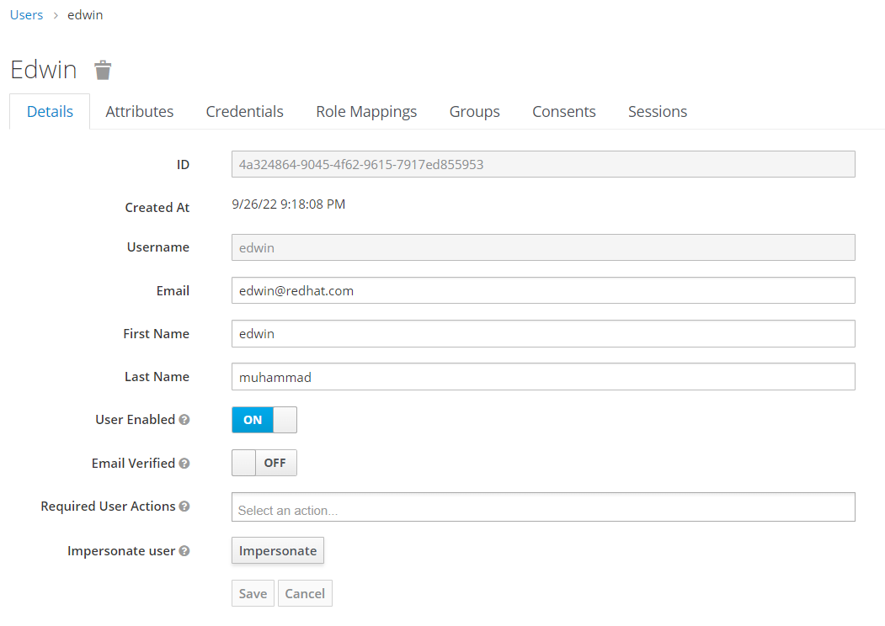

## Main Client Server 구성 시 설정
```
1) Keycloak 연동 시 추가 / 수정해야 할 파일 (security ver.)
    
    - CustomAuthenticationSuccessHandler.java

    - CustomLogoutSuccessHandler.java

    - SecurityConfiguration.java

    - SessionInterceptor.java

    - WebConfig.java

    - KeycloakConfigController.java

    - KeycloakController.java

    - pom.xml

    - + main.html (ex) 사용자 정보조회, 계정 잠금 관리, 로그아웃 등 기존 코드를 keycloak으로 요청)

2) application.properties 설정 예시

    ## Spring Security OAuth2 
    spring.security.oauth2.client.provider.external.issuer-uri=http://172.30.1.130:8080/realms/external
    spring.security.oauth2.client.registration.external.provider=external
    spring.security.oauth2.client.registration.external.client-name=resource-server1
    spring.security.oauth2.client.registration.external.client-id=resource-server1
    spring.security.oauth2.client.registration.external.client-secret=your_client_secret
    spring.security.oauth2.client.registration.external.scope=openid,offline_access,profile
    spring.security.oauth2.client.registration.external.authorization-grant-type=authorization_code

    ## Keycloak
    keycloak.realm=external
    keycloak.resource=resource-server1
    keycloak.auth-server-url=https://172.30.1.130:8080/realms/external
    keycloak.login-url=http://172.30.1.93:8083/oauth2/authorization/external
    keycloak.ssl-required=external
    keycloak.public-client=true
    keycloak.use-resource-role-mappings=true
    keycloak.principal-attribute=preferred_username
    keycloak.redirect-uri=http://172.30.1.93:8083
```

## Sub Client Server 구성 시 설정
```
1) Keycloak 연동 시 추가 / 수정해야 할 파일 (security ver.)

    - CustomAuthenticationSuccessHandler.java

    - SecurityConfiguration.java

    - pom.xml

1) application.properties 설정 예시

## Spring Security OAuth2
#spring.security.oauth2.client.provider.external.issuer-uri=http://172.30.1.132/realms/external
spring.security.oauth2.client.provider.external.issuer-uri=http://172.30.1.132:8180/realms/external
spring.security.oauth2.client.registration.external.provider=external
spring.security.oauth2.client.registration.external.client-name=resource-server4
spring.security.oauth2.client.registration.external.client-id=resource-server4
spring.security.oauth2.client.registration.external.client-secret=ep8RWnYjR5nJBfDzhT4vIVvk8iC5AZyD
spring.security.oauth2.client.registration.external.scope=openid,offline_access,profile,roles
spring.security.oauth2.client.registration.external.authorization-grant-type=authorization_code

## Keycloak
keycloak.realm=external
keycloak.realm-id=57598eef-0c50-4cb2-af6d-5999f5cc25a9
keycloak.resource=resource-server4
#keycloak.auth-server-url=https://172.30.1.132/realms/external
keycloak.auth-server-url=https://172.30.1.132:8180/realms/external
keycloak.login-url=http://172.30.1.93:8082/oauth2/authorization/external
keycloak.ssl-required=external
keycloak.public-client=true
keycloak.use-resource-role-mappings=true
keycloak.principal-attribute=preferred_username
keycloak.redirect-uri=http://172.30.1.93:8082
```

## 개인 메모 (작업 위치 변경 시 설정 확인)
```
1) application.properties
    - Spring Security OAuth2
    - Keycloak
    - Data Dictionary Logout URL

2) KeycloakController
    - getUserInfo()
    - unlockUser()

3) index.html
    - async function logout()
```

# Spring Boot 3, Spring Security, and Keycloak

## Purpose
A sample java code to demonstrate a Spring Boot 3 integration with Keycloak 17. It utilize Keycloak login page, and fetch a user's attribute based on Keycloak user profile. 

## Version
- Spring Boot 3.0.4
- Keycloak 17
- Red Hat OpenJDK 17

## Screenshots
Keycloak User Profile



JSON Response reading Keycloak Profile


## Blog Post
Explanation of this code can be seen on below `Red Hat Developer` article, 
```
https://developers.redhat.com/articles/2023/07/24/how-integrate-spring-boot-3-spring-security-and-keycloak
```

## Disclaimer
```
This code is provided "as is" without any guarantee whatsoever. 
Feel free to fork, add, remove, change, or do whatever you want with it. 
```